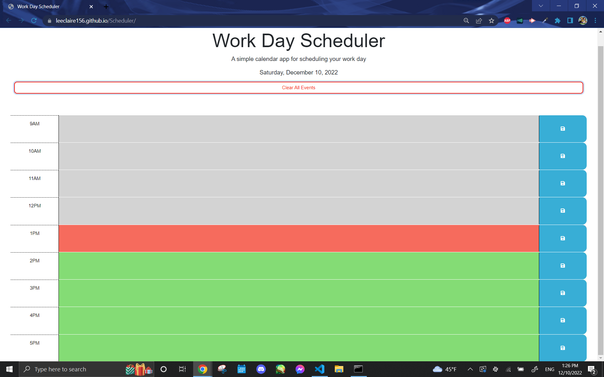
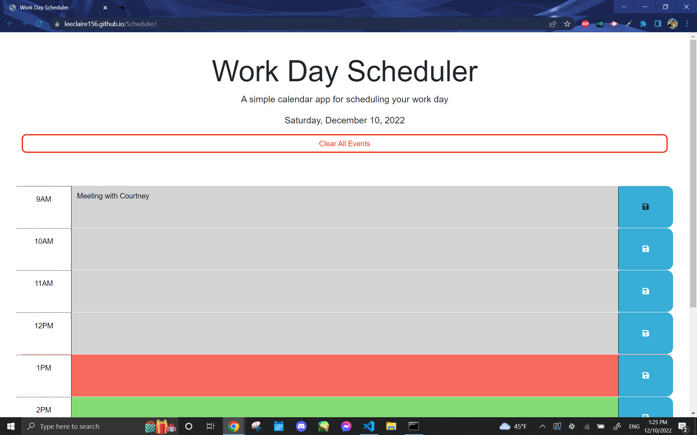
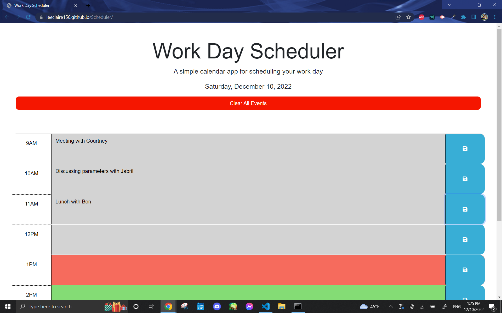
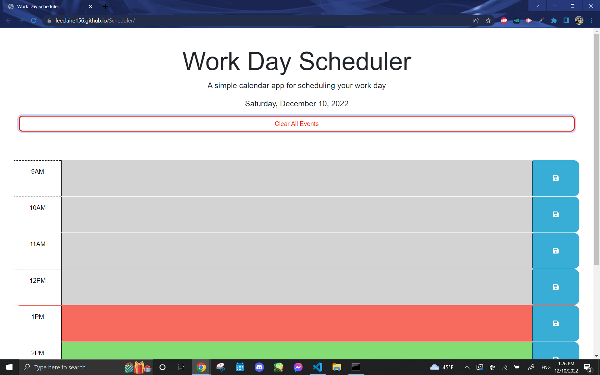

# Work Day Scheduler

## Description
This project utilizes third party APIs, Day.js and jQuery.js to create a work day (starting from 9 am to 5 pm) scheduler that allows the user to input events for each hour, save them, and clear them at the end of the day. In addition, there are color-coded text areas for each time block to indicate past (grey), present (red), and future (green) events based on the current time. 

## Usage
*Please click on the following link of the deployed website, https://leeclaire156.github.io/Scheduler/

* The scheduler application with a time slot for each hour between 9 AM to 5 PM should appear on screens upon load. Since the current time at the instance of writing this README file was past 1PM, the current time is indicated with a red text box. Past events are grey and future events are green coded.

* After typing in the event in the colored text boxes, events can be saved using the blue save buttons on the right hand side of the text box. Remember to save each event with the corresponding save button. These events will persist even after refreshing the page so long as you've properly saved them.

* Events can be cleared at the end of the day using the "Clear All Events" button at the top of the page.

## Credit and Tutorials followed:
* dayjs() format by [Day.js](https://day.js.org/en/):  
https://day.js.org/docs/en/display/format

* JS Siblings supplemental lesson provided by [JavaScript Tutorial](https://www.javascripttutorial.net/):  
https://www.javascripttutorial.net/javascript-dom/javascript-siblings/

* split() method review lesson provided by [W3 Schools](https://www.w3schools.com/):  
https://www.w3schools.com/jsref/jsref_split.asp

* Clear Storage supplemental lesson provided by [W3 Schools](https://www.w3schools.com/):  
https://www.w3schools.com/jsref/met_storage_clear.asp